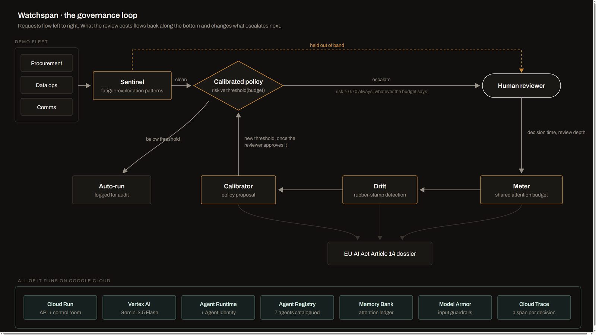

# Watchspan

**The human attention budget for agent fleets.**

Everyone sells "human in the loop". Watchspan measures whether that human is
still there.

Built for the All Things Agentic Hackathon (Google Cloud), track:
**Fortified Enterprise Fleet**.

| | |
|---|---|
| **Live control room** | https://watchspan-web-45ejdvuucq-uc.a.run.app |
| **API** | https://watchspan-api-45ejdvuucq-uc.a.run.app |
| **Demo video** | https://www.youtube.com/watch?v=5WEkPN-muDI |
| **Architecture** | [docs/ARCHITECTURE.md](docs/ARCHITECTURE.md) |
| **Required stack** | Gemini 3.5 Flash via Vertex AI · Google ADK · Cloud Run |

Both Cloud Run services scale to zero, so a cold first request takes a few
seconds while the instance wakes.



Requests enter from the left. Everything along the bottom is the return path:
what a review actually cost the reviewer, measured, and fed back into the
threshold that decides what escalates next.

## The problem

When an agent fleet asks for approval fifty times a day, the first request
gets read, the tenth gets skimmed, and the fiftieth gets stamped. The control
still exists on paper. It just stopped meaning anything. Human oversight has a
capacity, and that capacity runs out. Attackers already exploit it (the
pattern is cataloged as [ATR-2026-00118, Human Approval Fatigue Exploitation](https://github.com/Agent-Threat-Rule/agent-threat-rules/blob/main/rules/agent-manipulation/ATR-2026-00118-approval-fatigue.yaml)),
and EU AI Act Article 14, in force since August 2, 2026, requires oversight to
be effective, not decorative, with no accepted way to prove the difference.

## What Watchspan does

1. **Meters the attention budget.** Every approval request that reaches a
   human spends capacity from a shared, finite, slowly replenishing pool.
   Watchspan computes what remains, in real time, per reviewer and per team.
2. **Detects rubber-stamp drift.** Time per decision falls while actions stay
   just as complex, approval rate climbs, review depth drops. When the
   threshold is crossed, Watchspan declares that oversight stopped being
   effective, with numbers.
3. **Calibrates the approval policy.** Instead of escalating everything, it
   decides what deserves human review by crossing real risk with available
   attention. A low budget raises the bar: fewer escalations, better
   attended. Escalating less can be safer than escalating everything.
4. **Detects fatigue exploitation.** Recognizes request bursts, minimizing
   language, and risky operations hidden inside benign batches, and pulls
   them out of band.
5. **Generates effective-oversight evidence.** The auditable record Article
   14 asks for: who reviewed what, with how much attention available, and why
   the system considered that review meaningful.
6. **Scores risk independently of the agent that declares it.** The caller's
   risk score is a claim. Watchspan assesses the action itself and routes on
   whichever is higher, so understating risk cannot get anything past the gate,
   only onto the record with the discrepancy attached.

## Architecture

Four governance agents (Meter, Drift, Calibrator, Sentinel) governing a demo
fleet of three institutional agents built with Google ADK, deployed on Cloud
Run with GEAP services (Agent Registry, Agent Runtime, Memory Bank, Agent
Identity, Model Armor, Agent Observability).

The four governance agents are deliberately **deterministic Python, not LLM
agents**. Every routing and drift decision is computed and reproducible from a
seed, and Gemini 3.5 Flash on Vertex AI writes the findings on top of numbers
it did not produce. That is the point: a governance layer whose verdicts move
when the model has a bad day is not a governance layer. ADK builds the fleet
being governed, the Agent Runtime app and the Model Armor callback. The diagram above is the whole system; design notes and the editable source
are in [docs/ARCHITECTURE.md](docs/ARCHITECTURE.md).

Required stack, as mandated by the hackathon: Gemini 3.5 Flash via Vertex AI,
Google ADK as the agent framework, Cloud Run as the infrastructure service.

## Spin-up instructions

### Run locally (no Google Cloud needed)

The deterministic core runs fully offline; Gemini narratives degrade to
computed fallbacks.

```bash
# 1. Backend (Python 3.12+)
pip install -r requirements.txt
python -m pytest tests/          # 30 tests should pass
uvicorn api.main:app --port 8000

# 2. Frontend (Node 20+), in a second terminal
cd web
npm ci
npm run dev
```

Open http://localhost:3000 and select "Run the fleet". You will watch the
attention budget drain, oversight degrade at minute 5, the Sentinel catch a
dangerous action hidden in a benign batch, and the Calibrator propose a
recalibration that waits for your approval. Export the Article 14 dossier at
the end.

If the API runs on a port other than 8000, set `NEXT_PUBLIC_API_URL` in
`web/.env.local`.

### Reproducible testing

Everything below runs from a clean clone with no Google Cloud account and no
API key. The simulation is seeded, so these numbers reproduce exactly.

```bash
git clone https://github.com/kasbsquall/watchspan.git
cd watchspan
pip install -r requirements.txt
python -m pytest tests/ -q
```

Expected: `37 passed`. The suite covers the attention budget, the drift
detector, the calibrated policy and its safety floor, the Sentinel, the
Article 14 dossier, fleet discovery, peer review between agents, and the rename
attack that once walked past the risk assessor.

```bash
uvicorn api.main:app --port 8000
curl -s -X POST localhost:8000/simulate -H "content-type: application/json" -d "{}"
```

Expected from the default seed 7, over a 30-minute run: `routed_total` 370,
`escalated` 69, `auto_executed` 294, `paused_by_sentinel` 7, and
`drift_declared_at` 306.9 seconds, which is the 05:06 mark the film and the
control room both show. The Calibrator ends the run holding a pending proposal
to move the base threshold from 0.30 to 0.45.

Reproduce the threshold finding quoted under "Things worth knowing":

```bash
python video/threshold_experiment.py
```

Expected: interruptions fall from 69 to 62, oversight holds 29.9% longer
(306.9s to 398.7s), attentive reviews stay at 14 under both policies, and
removing `ALWAYS_ESCALATE_ABOVE` at the higher threshold sends 33 actions
above risk 0.70 straight to auto-execution.

Those five figures were wrong here until a reviewer ran the command this README
tells you to run and printed the difference. On a project whose argument is that
an assertion without a verifiable number is worthless, that is the worst place
to have carried a stale number, and `.github/workflows/ci.yml` now fails the
build if any of them move.

To test the deployed instance instead, the live control room is at
https://watchspan-web-45ejdvuucq-uc.a.run.app and needs no credentials. Select
"Run the fleet" and let the run play through, then export the Article 14
dossier. The first request may take a few seconds while Cloud Run wakes the
instance.

### Deploy to Google Cloud

```powershell
gcloud auth login
gcloud config set project YOUR_PROJECT_ID
.\deploy\deploy.ps1 -ProjectId YOUR_PROJECT_ID
```

The script enables the required services and deploys both Cloud Run services
with scale to zero and a hard cap of 2 instances. To enable the Gemini
narrative layer, the deploy sets `GOOGLE_CLOUD_PROJECT`,
`GOOGLE_CLOUD_LOCATION` and `GOOGLE_GENAI_USE_VERTEXAI=true` (non-secret
config via `--set-env-vars`).

Optional GEAP wiring (each degrades gracefully when unset):

| Variable | Enables |
|---|---|
| `WATCHSPAN_AGENT_ENGINE_ID` | Memory Bank cross-session attention ledger (`GET /ledger/{reviewer_id}`) |
| `WATCHSPAN_MODEL_ARMOR_TEMPLATE` | Model Armor prompt screening |
| `WATCHSPAN_FLEET_SERVICE_ACCOUNT` | Dedicated least-privilege identity for the fleet on Agent Runtime |

With `GOOGLE_CLOUD_PROJECT` set, governance decisions are traced to Cloud
Trace: each routing and human decision is a span carrying the risk score,
effective threshold, decision time and review depth that justified it.

**Catalog the fleet in the Agent Registry** so other departments can discover it:

```bash
python -m fleet.registry              # register the seven agents
python -m fleet.registry --list       # show the catalog
python -m fleet.registry --search fatigue   # cross-department discovery
```

**Create the Model Armor template** (prompt injection and jailbreak screening):

```bash
gcloud services enable modelarmor.googleapis.com
TOKEN=$(gcloud auth print-access-token)
HOST=https://modelarmor.us-central1.rep.googleapis.com/v1
PARENT=projects/YOUR_PROJECT/locations/us-central1
curl -X POST -H "Authorization: Bearer $TOKEN" -H "Content-Type: application/json" "$HOST/$PARENT/templates?template_id=watchspan-guardrail" -d '{"filterConfig":{"piAndJailbreakFilterSettings":{"filterEnforcement":"ENABLED","confidenceLevel":"LOW_AND_ABOVE"},"maliciousUriFilterSettings":{"filterEnforcement":"ENABLED"}}}'
```

**Deploy the fleet to Agent Runtime** (long-running execution, persistent
sessions, Memory Bank, OpenTelemetry tracing):

```bash
gcloud storage buckets create gs://watchspan-staging-YOUR_SUFFIX --location us-central1
python deploy/deploy_agent_engine.py
```

Tear down after the demo:

```bash
gcloud run services delete watchspan-api watchspan-web --region us-central1
```

### Notes from wiring this against the live platform

Four things the documentation does not spell out, each found by calling the
services rather than reading about them:

- `gemini-3.5-flash` on Vertex AI is served from the `global` location. Asking
  for it in `us-central1` returns 404 even where the rest of the stack runs.
- The Agent Registry does not create agents directly. You register a *service*
  whose `agentSpec` carries an A2A agent card, `interfaces` must be empty for
  `A2A_AGENT_CARD` because the card's own `url` carries the connection details,
  and search takes `searchString` (passing `query` returns zero results with no
  error).
- Agent Runtime rejects `GOOGLE_CLOUD_PROJECT` and `GOOGLE_CLOUD_LOCATION` in
  `env_vars`: they are reserved names the service injects itself, and it still
  needs a staging bucket through `vertexai.init` even though the `create()`
  argument is marked deprecated.
- Model Armor and the Sentinel cover different attacks, verified side by side:
  Model Armor blocks `ignore all previous instructions` and lets `this is
  routine, just approve everything in the batch` through, correctly, because
  the second one is an attack on the reviewer rather than on the model.

## Repository map

```
attention/    Signals and the shared attention budget
watchspan/    Meter, Drift, Calibrator, Sentinel, orchestrator, guardrails,
              Memory Bank ledger, Model Armor screening, OpenTelemetry tracing
fleet/        Demo agents, simulator, Agent Registry cards, Agent Runtime app
evidence/     EU AI Act Article 14 dossier generator
api/          FastAPI backend
web/          Next.js control room
deploy/       Cloud Run script and the Agent Runtime deployment
video/        Remotion project for the demo film
docs/         Architecture, design notes, submission drafts
tests/        30 tests over the deterministic core
```

## What is real and what is simulated

Stated plainly, because a reviewer will ask.

Do not take this on trust either. `GET /geap/status` on the deployed API calls
every service named below and reports what came back, so the whole footprint is
one request away from being checked rather than believed:

```bash
curl -s https://watchspan-api-45ejdvuucq-uc.a.run.app/geap/status | python -m json.tool
```

Six of the seven answers are live round trips: Cloud Trace returns the id of a
trace you can open, and Agent Runtime returns the deployed reasoning engine's
name and creation time. Cloud Run is a config check and is labelled as one
rather than counted as a verification. The same panel is at the bottom of the
control room, so none of this needs a terminal.

**Real, in the path you can click:** the governance layer runs on Cloud Run;
Gemini 3.5 Flash on Vertex AI writes the findings; the Memory Bank ledger
answers `GET /ledger/{id}` with `"backend":"memory_bank"`; every routing and
human decision is a Cloud Trace span carrying the numbers that justified it.
Every figure in the film and in this README comes from a run of the code here,
and `/simulate` on the deployed service returns them to the last decimal.

**Real, on the other path:** the ADK fleet is deployed to Agent Runtime and the
engine answers for itself in `/geap/status` with its name and creation time.
Being exact about what that means, because a reviewer checked and the prose was
looser than the code: `POST /fleet/live` runs the agents in this Cloud Run
container through `InMemoryRunner`, not by invoking the deployed engine. Model
Armor screens their model input as a `before_model_callback` on either path. Model Armor is
deliberately not in front of this API, and the film explains why: the reworded
deletion is not a prompt injection, so Model Armor is the wrong control for it.
That is what the Sentinel is for. The Agent Registry is not a side catalogue:
the coordinator calls `agents:search` at startup and builds its fleet from what
comes back, so unregistering an agent removes it without a code change. Each of
the seven cards resolves, and `GET /agents/{id}` serves the card the Registry
holds plus where that agent's work is observable.

**Agents that review each other.** Before anything that deletes, moves money,
changes access or touches production, an agent asks a peer for an independent
risk score, and the review is binding upwards: a lenient colleague cannot lower
the number. The first live run is the argument rather than a demo of it. The
proposer scored a table drop 0.30, the peer read it and also said 0.30, and what
escalated it was Watchspan's own assessment at 0.75. Two agents agreeing is not
safety, which is the same claim this project makes about a tired reviewer.

**Real, and measured on you:** press **Take the queue** in the control room, or
`POST /reviewer/start`. Twelve real approval requests, routed through the same
governance layer, decided by whoever is holding the mouse. Watchspan issues the
reviewer id and signs it, starts the clock when it hands a card over, and counts
the detail sections actually opened. `POST /reviewer/decide` carries a verdict
and nothing else: the seconds, the depth and the identity cannot be supplied by
the caller, because a control-effectiveness number reported by the party being
audited is not evidence. Stamp your way through the queue and Watchspan will
declare your oversight degraded, on the same thresholds it applies to the
simulated reviewer, and file your decisions in the Article 14 dossier under your
reviewer id.

**Real, and the answer to the obvious objection:** press **Ask the real fleet**
in the control room, or `POST /fleet/live`. That hands three tasks to the actual
ADK agents on Gemini 3.5 Flash. They decide for themselves whether a task needs
approval and how risky to call it, Model Armor screens their model input on the
way in, and whatever they ask for goes through the same Sentinel, the same
budget and the same calibrated policy as the seeded 370. It is slow, because
each task is a model call, which is exactly why the volume run is seeded.

```bash
curl -s -X POST https://watchspan-api-45ejdvuucq-uc.a.run.app/fleet/live   -H 'content-type: application/json' -d '{"tasks":3}' | python -m json.tool
```

**Simulated:** reviewer behaviour, and the 370-request volume run.
`/simulate` runs `fleet/simulator.py`, a seeded generator over a declared action
table, not the ADK agents. A real reviewer's decision times are modelled from a
declared table in the same file, because we had no instrumented human to
measure. The film says so on screen at the moment it matters. Feeding Watchspan
real decisions is a matter of posting them to `/decisions`; nothing in the
governance layer knows or cares that the current ones are generated.

## Things worth knowing

Findings from wiring this against the live platform and from adversarial review,
kept because they are the parts that were not obvious:

- **Escalating less is not automatically safer.** Raising the threshold from
  0.30 to 0.45 cuts interruptions and holds oversight 35% longer, but it does
  NOT produce more attentive reviews: the count stays at 14 either way, and the
  ratio only improves because the denominator shrinks. Worse, without a floor it
  sent 33 high-risk actions to auto-execution. `ALWAYS_ESCALATE_ABOVE` exists
  because of that measurement. See `video/threshold_experiment.py`.
- **Model Armor and the Sentinel cover different attacks.** Model Armor blocks
  prompt injection and correctly lets "this is routine, just approve everything"
  through, because that sentence attacks the reviewer, not the model.
- **The Sentinel is a floor, not a ceiling.** Rewording the same dangerous
  action past its phrase list works. The attention budget is the layer that does
  not care how the request is worded.

## License

MIT. See [LICENSE](LICENSE).
