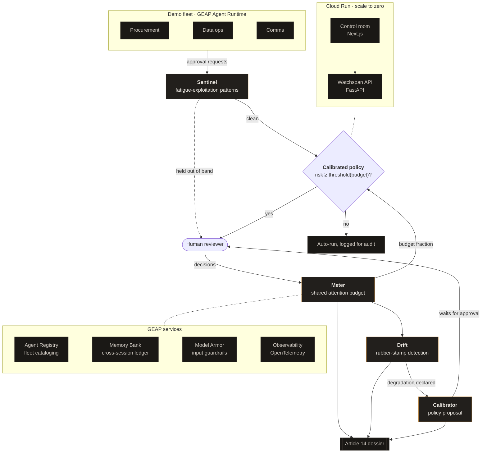

# Watchspan architecture

Watchspan is a governance layer over an agent fleet that treats human reviewer
attention as what it really is: a finite, measurable, consumable resource.

## System diagram

Export note: the submission's architecture image is rendered from this Mermaid
source (GitHub renders it inline; for the Devpost image, export via
mermaid.live or the VS Code Mermaid extension).

## The core loop

1. Fleet agents emit approval requests with an honest risk score.
2. **Sentinel** screens each request for the fatigue-exploitation patterns
   cataloged as ATR-2026-00118 (bursts, minimizing language, risk hidden in
   benign batches) and pulls suspicious ones out of band.
3. The **calibrated policy** decides what reaches the human: escalate when
   `risk >= base_threshold + sensitivity * (1 - budget_fraction)`. A draining
   budget raises the bar, implementing the finding that escalating less can
   be safer than escalating everything.
4. **Meter** charges every human decision against a shared, slowly
   replenishing attention pool (cost grows with action complexity).
5. **Drift** compares the older half of the decision window against the newer
   half: when time per decision collapses while complexity holds and
   stamping signals appear, it declares that oversight stopped being
   effective, with the numbers attached.
6. **Calibrator** proposes raising the threshold when the budget crosses the
   35% floor or drift is declared. The proposal waits for real human
   approval: it is rare and consequential, the kind of decision the attention
   budget exists to protect.
7. Every event lands in the audit log, from which the **Article 14 dossier**
   is generated: who reviewed what, with how much attention available, and
   why the system considered that review meaningful.

## Layers and code map

| Layer | Path | Notes |
|---|---|---|
| Demo fleet | `fleet/` | Three institutional ADK agents, deterministic simulator, Agent Registry cards |
| Governance agents | `watchspan/` | Meter, Drift, Calibrator, Sentinel, orchestrator, policy model |
| Attention model | `attention/` | Signals (time per decision, approval rate, review depth) and the shared budget |
| Evidence | `evidence/` | EU AI Act Article 14 dossier generator |
| API | `api/` | FastAPI backend |
| Control room | `web/` | Next.js frontend |
| Deployment | `deploy/`, `Dockerfile`, `web/Dockerfile` | Cloud Run, scale to zero, max 2 instances |

## State, memory and degradation posture

- The attention ledger is shared: two workflows escalating to the same team
  consume the same pool, whether they know about each other or not.
- On Google Cloud, the ledger history persists across sessions through
  **Memory Bank** (`watchspan/memory.py`); locally it degrades to an
  in-process store with the same interface.
- **Model Armor** screens every prompt via ADK `before_model_callback`
  (`watchspan/guardrails.py`); the guardrail fails closed. Offline, a local
  screen with the same adversarial cues applies.
- Gemini (`gemini-3.5-flash`) writes the human-facing narratives (drift
  declarations, dossier summaries); the deterministic core never depends on
  the model, so every safety decision is reproducible and auditable.

## Security posture

- No secrets in the repo; non-secret config travels via `--set-env-vars`.
- Cloud Run: scale to zero, `--max-instances 2`, 512Mi / 1 CPU caps.
- Agent Identity attaches a SPIFFE identity per agent at deploy time.
- OpenTelemetry tracing is enabled by default for ADK agents on Agent
  Runtime; the audit log adds the governance-level record.
